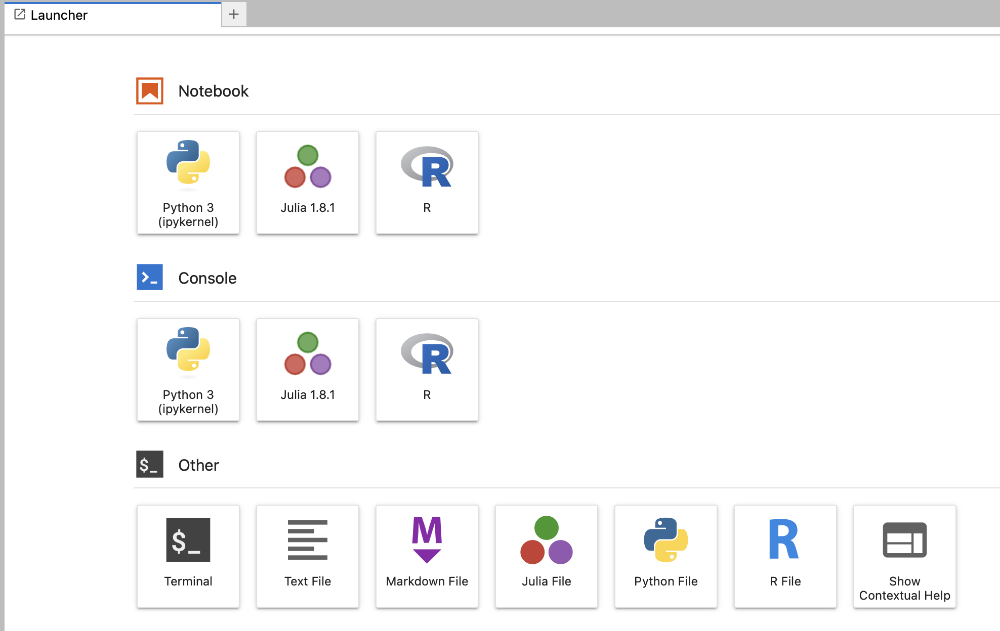

# Starting a terminal

A **terminal** window is how you can access the command line.  To get started you need to open one! Depending on how you
are running this tutorial, there are a few different ways to do this.  If you haven't done so already, go and follow the
[environment setup instructions](../../prerequisites) to get one.  You can either

- use a terminal directly (or within Visual Studio Code)
- or use a terminal through a JupyterLab instance.

**Opening a terminal on JupyterHub**.  If you have [set up a JupyterLab site](../../prerequisites/Jupyterlab.md), you
should see a page that looks something like this:



To start a terminal, click the 'Terminal' button which should give you something like this:


**Opening a terminal directly**

Otherwise, if you've followed the [environment setup instructions](../../prerequisites) you should already have a
terminal program to use - either built-in, or using the Ubuntu for Windows system on Windows.

## Checking it works

Either way you should see something like this:

```
<username>@<computer name> ~ % ▮
```

:::tip Note

What you see there is the **command prompt**.  It will probably show your username, the name of the computer you're
using, and also the path to the directory you are currently in.  (This might be just `~`, meaning your home directory.)
And then it will end with a `$` or `%` character to indicate the prompt itself.

This command-line prompt can look a bit different depending on where you are running from.  In this tutorial we will generally
just write a dollar `%` to indicate the prompt.

:::

To check things are working, let's try out a simple command - type `echo "Hello, $USER!"`into the terminal and press
`Enter`.  You should see something like:

```
% echo "Hello, $USER!"
Hello, gav!
```

If this is your first UNIX command - congratulations!

:::caution Note

Remember that in the above - the `%` indicates the command prompt.  You shouldn't type the `%` but just type the command and then press `<Enter>` to make it run.
:::

Once you have this working, move on to the [command-line basics](02_basics.md).

