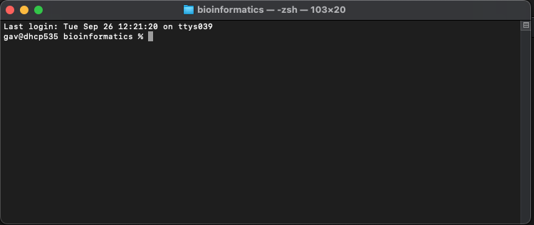

# Getting started with the command line

Welcome!  The UNIX **command-line** interface (sometimes also called “**command prompt**” or “**terminal**”) is a way of
interacting with the computer using only the keyboard.  If you haven't seen one before, it looks something like this:

Many of the programs and tools used in bioinformatics are designed to work only from command-line, so for genomic
analysis it’s very important to get familiar with how the terminal works.

## Why should we learn to use the command line?

Here are some reasons:
* For many tasks it’s faster than using a GUI (Graphic User Interface).
* It's flexible: you can combine multiple programs, making the output of one the input of the next in a pipeline.
* Most bioinformatics tools are made for the command-line.
* It can efficiently handle big files that gui based tools might struggle to open.
* The command line has lots of powerful commands for parsing text files.
* High-performance computing: compute clusters don't usually have a GUI!
* Some binary files (e.g. BAM or CRAM) can only be handled with dedicated command-line software (for example [samtools](https://github.com/samtools)).

To get started you need a terminal window.

When you're ready to start - go and start [a terminal](./01_starting.md).