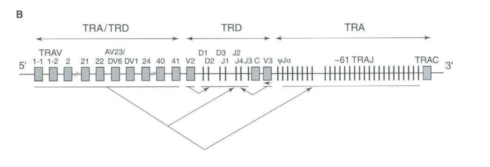

import Tabs from '@theme/Tabs';
import TabItem from '@theme/TabItem';

# What's not a gene?

Above we counted all "genes".  But what exactly is a "gene"?

One way to figure out what 'gene' means in these files, is to compare to the other record types in the data. For
example, you can find all the top-level record types (those with no `Parent`) in the file like this:

<Tabs groupId="language">
<TabItem value="sqlite" label="sqlite3 code">

```sql
sqlite> SELECT dataset, type, COUNT(*) FROM gff WHERE Parent IS NULL GROUP BY dataset, type
```

</TabItem>
<TabItem value="R" label="R code">

```r
(
	dbGetQuery( db, "SELECT * FROM gff WHERE Parent IS NULL" )
	%>% group_by( dataset, type )
	%>% summarise( count = n() )
)
```

</TabItem>

<TabItem value="dbplyR" label="dbplyr code">

```r
(
	db
	%>% tbl( 'gff' )
	%>% filter( is.na(Parent ))
	%>% group_by( dataset, type )
	%>% summarise( count = n() )
	%>% collect()
)
```

</TabItem>

<TabItem value="python" label="Python code">

```python
types = pandas.read_sql(
	"SELECT dataset, type, COUNT(*) FROM gff WHERE Parent IS NULL GROUP BY dataset, type",
	db
)
```
</TabItem>

</Tabs>

:::caution Note

For the example above, and those from now on, we will assume you have already connected to the database [as we did on
the previous page](./002_Counting_genes_1.md).  Depending on how you are running this, you can connect like this:

<Tabs groupId="language">
<TabItem value="sqlite" label="sqlite3 code">

```sh
sqlite3 genes.sqlite
sqlite3> .mode column
sqlite3> .header on
```

</TabItem>

<TabItem value="R" label="R code">

```r
library( RSQLite )
library( dplyr )
db = DBI::dbConnect( RSQLite::SQLite(), "genes.sqlite" )
```

</TabItem>
<TabItem value="python" label="Python code">

```python
import pandas, sqlite3
db = sqlite3.connect( "genes.sqlite" )
```

</TabItem>
</Tabs>

If not, please do that now and then re-run the above.

:::

Whichever way you do this, you should see that all the files have a bunch of records other than protein-coding genes.
There are, at least, *pseudogenes* and *non-coding RNAs*, as well as a bunch of so-called *biological regions* and
*untranslated regions*.

:::tip Question

What are pseudogenes and non-coding RNAs anyway?  To see the technical definitions, look them up on [the sequence
ontology](http://www.sequenceontology.org/browser/obob.cgi).

For more information, here is [an interesting reference on
pseudogenes](https://www.ncbi.nlm.nih.gov/pmc/articles/PMC3491395/) and on [non-coding
RNAs](https://www.frontiersin.org/articles/10.3389/fgene.2015.00002/full).

:::

## Different types of gene

What sets apart *genes* from *pseudogenes* and *non-coding RNAs* is that they code for proteins. However, it's not quite
that simple. If you look more closely at the records with `type=gene`, you'll see they have a number of different
"biotypes" (which, if you've followed so far, you will have avialable in the `biotype` column.)

:::tip Challenge

Extend the query above to count records by both `type` and `biotype`.  

What types of gene record are there?  What types of non-coding RNA?  What types of pseudogene?

The [sequence ontology](http://www.sequenceontology.org/browser/obob.cgi) page is a good first place to look these up
if you want to know more about them.

:::

## Aside on T and B cell receptors

One of the record types you'll see looks like genes called 'IG_C_gene', 'IG_D_gene', and so on.  And some are called
'TR_C_gene' and so on.

These are **immunoglobulin** and **T cell receptor** gene segments respectively.  The mechanism that turns these gene
segments into functional, expressed genes that code for proteins - known as V(D)J recombination - is complex, and
involves somatic structural variation that brings 'V_gene', 'J_gene', and at some loci 'D_gene' segments together to form
fully functional genes.  This only happens in [B cells](https://en.wikipedia.org/wiki/B_cell) and [T
cells](https://en.wikipedia.org/wiki/T_cell) and is a basic component of the adaptive immune system.

For example, here is a cartoon of the T cell receptor 'alpha' and 'delta' regions from the [T cell Receptor Factsbook](https://www.imgt.org/IMGTindex/factsbook.php):



The arrows underneath indicate a schema of how the 'V' and 'J' segments are joined together, or the 'V', 'D', and 'J' segments for the TRD genes.
The component genes are chosen randomly in each cell to generate a high level of receptor diversity.  

:::tip Note

If that's not complicated enough - the diagram also shows that the TRD locus is situated inside the TRA locus.
Sometimes they also recombine together to make hybrid A/D genes.

:::

In any case - although these genes *do* code for proteins, they aren't standard 'protein coding genes' in that they
don't form full genes in most cells - only after recombination in T and B cells.  For that reason they are seperated out
from protain coding genes in the data.

