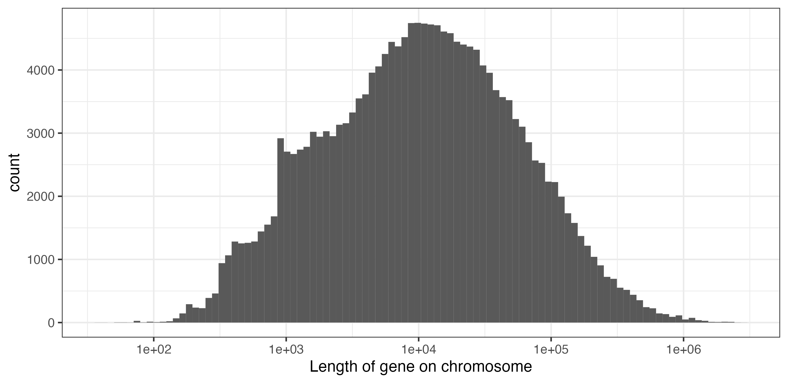

# Gene length


To find the longest genes *as measured by length on the genome*, a good place to start would be to histogram gene
length.  Here is a basic version:

```r
genes$length = end - start + 1
p = (
	ggplot( data = genes )
	+ geom_histogram(
		aes( x = length ),
		bins = 100
	)
	+ xlab( "Length of gene on chromosome" )
	+ theme_minimal()
)
print(p)
```

:::tip Note
Gene lengths vary so widely that this can be a bit hard to read.  Try transforming the x axis to a [log10 scale](https://ggplot2.tidyverse.org/reference/scale_continuous.html) to see the distribution better.  You might end up with something like this:



You could also [facet by dataset](https://ggplot2.tidyverse.org/reference/facet_wrap.html) (add `facet_wrap( ~dataset
)`) to separate the species.

:::

Another option is to plot gene length against number of transcripts, coloured by dataset, say - is this revealing?

Either way, from your plots you should now be able to read off the length of the longest and shortest gene lengths.  

To actually find those genes - try using `arrange()` or `filter()` to pull them out.  For example:
```r
genes %>% arrange( desc(length)) %>% head(20)
```

:::tip Note

Explore these genes now using the genome browsers or web searches.
Are the longest genes similar across different species?  Are different genes among the longest biologically similar - what aspects of biology are they involved in?

:::

:::caution Note

Is there anything odd about the histogram of gene lengths?  Use your detective skills to investigate.

:::

:::tip Note

Look for the shortest genes as well - what are they?

In humans, the shortest annotated genes seem to be tiny - only a few tens of basepairs long!  Look them up on the genome
browsers - is there anything unusual about them?  Do all short genes look similar?

:::

