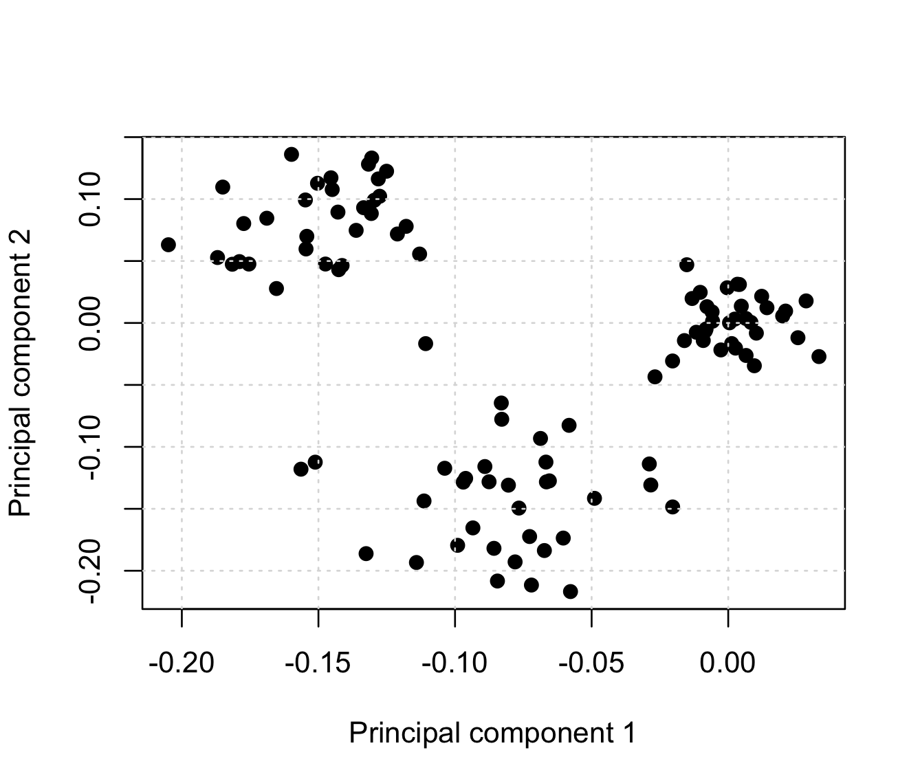
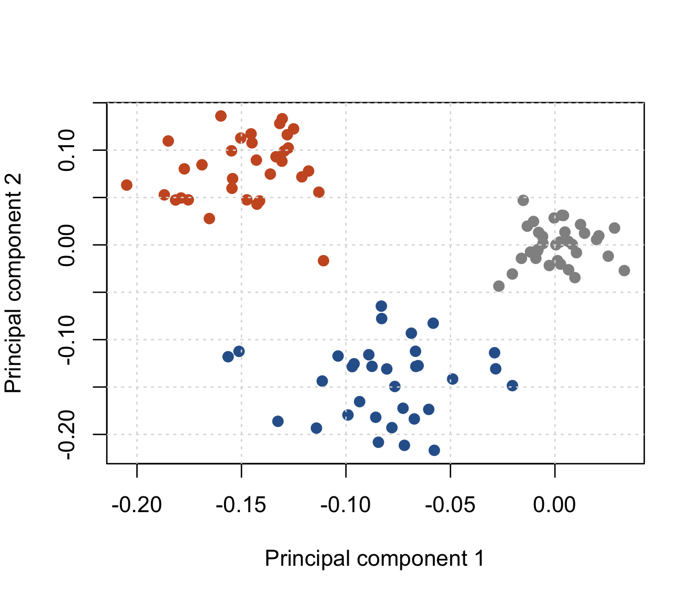

# A simulated example


In this tutorial we'll use PCA to analyse a matrix of genotypes, of the type you would find in a genome-wide association study. Before doing this, let's try simulating a quick example in R to see how it works.  But before doing *that*, let's do some quick maths.


## Simulating some data

We'll work with a matrix with 1,000 rows and 100 columns:
```r
L = 1000
N = 100
X = matrix(
	NA,
	nrow = L,
	ncol = N
)
```

To start with let's fill this with random values from a normal distribution:
```r
X[,] = rnorm( L*N, mean = 0, sd = 0.5 )
```

Now let's add some structure - first we'll take a couple of sets of rows to work with:
```r
rows1 = 1:500
rows2 = 250:500
```

and a couple of random sets of samples:
```r
cols1 = sample( 1:N, 66 )
cols2 = sample( cols1, N/3 )
```

We'll add structure by adding some random stuff with nonzero mean to each of the subsets:
```r
X[rows1,cols1] = X[rows1,cols1] + rnorm( length(rows1) * length(cols1), mean = 0.25, sd = 0.5 )
X[rows2,cols2] = X[rows2,cols2] + rnorm( length(rows2) * length(cols2), mean = -0.4, sd = 0.5 )
```

So, we should have several sets:
* a set of 100 samples, of which
* two-thirds are more similar to each other because they have a bit added at the first set of SNPs
* and one-third are even more similar to each other, because they have an extra bit added at the second set of SNPs

Let's see if we can see this structure visually using `image()`:

```
image(
	t(X),
	x = 1:N,
	y = 1:L,
	xlab = "columns",
	ylab = "rows"
)
```


:::tip Question
Do you see any structure - if so is it what you expect?
:::

## Computing principal components

You probably can't much  structure in the columns of the matrix - even though we know it is there.  So let's see if
principal components can identify it.

There are several equivalent ways to run a PCA but the one we will use is based on computing a matrix of "similarity"
(or, as we will say for genetic data below, 'relatedness') between columns.  This similarity matrix is of dimension
$N\times N$ and can be computed very simply indeed:

```r
R = X^t X
```

:::tip Note

In case you're not used to looking at matrix maths, here's what the above means.

It says: take the matrix $X$, which has dimension $L\times N$ (i.e. it has $L$ rows and $N$ columns) and *transpose* it.
(Transposing it means 'rotating' by 90 degrees, so the rows become columns and vice versa). Then multiply it by itself. 

Here 'multiply' means matrix multiplication: you go along rows and down columns.  The entry in row $i$ and column $j$ of
the result is the *dot product* of the $i$th and $j$th columns of $X$.

:::

We can now compute principal components by computing the *eigendecomposition* of the matrix $R$:
```r
R = t(X) %*% X
pca = eigen(R)
```

:::tip Note

As usual you can see the structure of the output objectusing `View()` or `str()`. The matrix $X$ has 100 columns, and
the output object has 100 *eigenvalues* (`pca$values`) and 100 *eigenvectors* (`pca$vectors`), each of length 100.  The
entries of the eigenvectors are the **principal components**.

:::


Let's see what this has made of the result by plotting the first two principal components against each other:

```r
plot(
	x = pca$vectors[,1],
	y = pca$vectors[,2],
	xlab = "Principal component 1",
	ylab = "Principal component 2",
	# Make the points filled-in, because it looks better
	pch = 19
)
grid()

```

You will probably see something like this:


Woah! PCA has indeed magically found out some structure in our data!

To see if it is correct, let's add a column with some colour:
```r
colours = rep( "grey50", N )
colours[ cols1 ] = "orangered3"
colours[ cols2 ] = "dodgerblue4"
plot(
	x = pca$vectors[,1],
	y = pca$vectors[,2],
	xlab = "Principal component 1",
	ylab = "Principal component 2",
	# Make the points filled-in, because it looks better
	pch = 19,
	# Colour the points
	col = colours
)
grid()

```



As you can see, PCA has seperated out the three populations of samples - indeed it has done it pretty well in my version
of the data above.

:::tip Note

The sample sets are clearly seperated in the first two principal components.  But the method isn't perfect, for example,
  it hasn't actually told us what the three sets are (we can see them allright, but would need extra work to get it to tell us what they actually are.)

:::

## The duality of PCA

What if we don't eigendecompose $X^t X$ (of dimension $N\times N$), but decompose $X X^t$ (of dimension $L\times L$)
instead?  Answer: we get the **row loadings**:

```r
loadings = eigen( X %*% t(X) )
```

```r
layout( matrix( 1:2, ncol = 1 ))
par( mar = c( 4, 4, 1, 1 ))
plot(
	1:1000,
	abs(loadings$vectors[,1]),
	xlab = "row",
	ylab = "Loading",
	pch = 19
)
plot(
	1:1000,
	abs(loadings$vectors[,2]),
	xlab = "row",
	ylab = "Loading",
	pch = 19
)

```

The loadings are in a sense 'dual' to the PCs, and have a specific interpretation.  

* The $i$th loading expresses *how much the $i$th row contributes to the PCs.

* The PCs are linear combinationss of the rows of $X$ - the weights are the loadings.

In fact the $i$th loading expresses how much each row contributes to the $i$th principal component.  Specifically
**to get the $i$th PC, you project samples onto the $i$th loading**.

In fact, the PCs are the **projections** (or 'dot products') of the matrix columns onto the loadings, after the right
scaling.  You can check this as follows.  First compute the projections like this:

```r
projections = t(X) %*% loadings$vectors
```
Now let's divide the each projection by the corresponding eigen alues


The loadings express


What you might see here is that, although the PCA has somewhat identified rows among the first 500 has being important 


## The duality of

We simulated the structure at subsets of rows too - has the PCA find those?

To find this we can compute what are usually called *loadings* - the amount that each row contributes to each PC. 
The loadings can be simply computed as 
