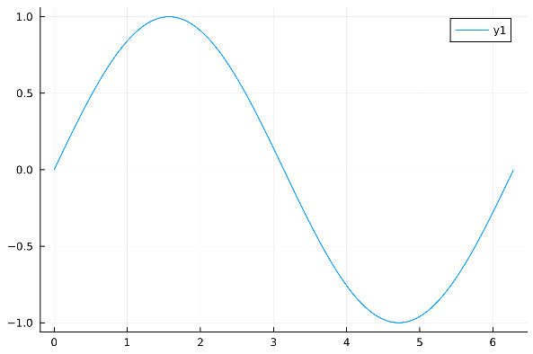

# Julia

Julia is an interesting language that is pretty good for many data analysis and computational
tasks. Like python it has a rich ecosystem of data analysis packages but it has a few features that
make it different from others

- like C++ it is strongly typed and compiled.  It's easier to avoid paying a performance cost than in python or R.
- Nevertheless it acts much like an interpreted language, like Python or R.
- It also has an interesting approach based on *multiple dispatch* (different, say, from object-oriented languages like python)

## Installing Julia

Installing julia is easy using conda:
```
mamba install -c conda-forge julia
```

Or by downloading directly from the [julia website](https://julialang.org). (**Note.** As before,
on Windows you will likely want to install into your UNIX terminal instead - using conda is
simplest for that.)

Once installed you can start it by typing `julia`:

```
$ julia

               _
   _       _ _(_)_     |  Documentation: https://docs.julialang.org
  (_)     | (_) (_)    |
   _ _   _| |_  __ _   |  Type "?" for help, "]?" for Pkg help.
  | | | | | | |/ _` |  |
  | | |_| | | | (_| |  |  Version 1.7.2 (2022-02-06)
 _/ |\__'_|_|_|\__'_|  |  Official https://julialang.org/ release
|__/                   |

julia> 
````

See the [Julia webpage](https://www.julialang.org) for more details.

## Trying it out

To test it, let's try a few things.  For example we could create a string variable:

```
julia> a = "Hello, this is a string"
```

...or split it into words:

```
julia> words = split( a, "," )
```

...or count their lengths:
```
julia> map( length, words )
```

To go a bit further, let's install some packages. Press `]` to enter the Julia *package manager*. The prompt should
change to something like this:

```
(@v1.8) pkg>
```

Add the `Plots` and `Distributions` packages (this might take a few minutes):

```
(@v1.8) pkg> add Plots, Distributions
    Updating registry at `~/.julia/registries/General.toml`
   Resolving package versions...
   Installed xkbcommon_jll ─ v1.4.1+1
  No Changes to `~/.julia/environments/v1.8/Project.toml`
    Updating `~/.julia/environments/v1.8/Manifest.toml`
  [d8fb68d0] ↑ xkbcommon_jll v1.4.1+0 ⇒ v1.4.1+1
Precompiling project...
  6 dependencies successfully precompiled in 44 seconds. 283 already precompiled.
```

To get out of package mode again, press `<backspace>` (or `ctrl-C`.).

The `add` command has installed the packages but not imported them into our local session.
To tell julia we want to use them, use `using`:

```
julia> using Plots, Distributions
```

Now we can make some simple plots, rather similar to the ones we made [in R](R.md#trying-it-out):
```
x = 0:0.01:2 * pi
y = sin.( x )
plot( x, sin.( x ))
```



:::tip Note

The `.` after `sin` is not a mistake - it's actually a julia feature which expands the use of a function (`sin()`)
across an array of numbers.

In `R` we didn't need this - it happens automatically with many functions.  But it can also get awkward when you reach a
function that doesn't work on vectors like this (as sometimes happens when you are writing code).

The julia approach is actually often nice - you write the function once, operating on one number, and then to apply it across
arrays you use the `.`.

:::

Or we can generate and plot a million samples from a Gaussian distribution:
```
data = rand( Normal(0, 1), 1000 )
histogram( data, bins = 25 )
```


## Getting help

Julia also has a great help system - type `?` to get into the built-in help, then search for a topic such as `histogram`.

## Next steps

Like [R](R.md) and [python](python.md), perhaps the nicest way to use julia for interactive work is through JupyterLab.
See [how to install Jupyterlab](Jupyterlab.md) for details.
