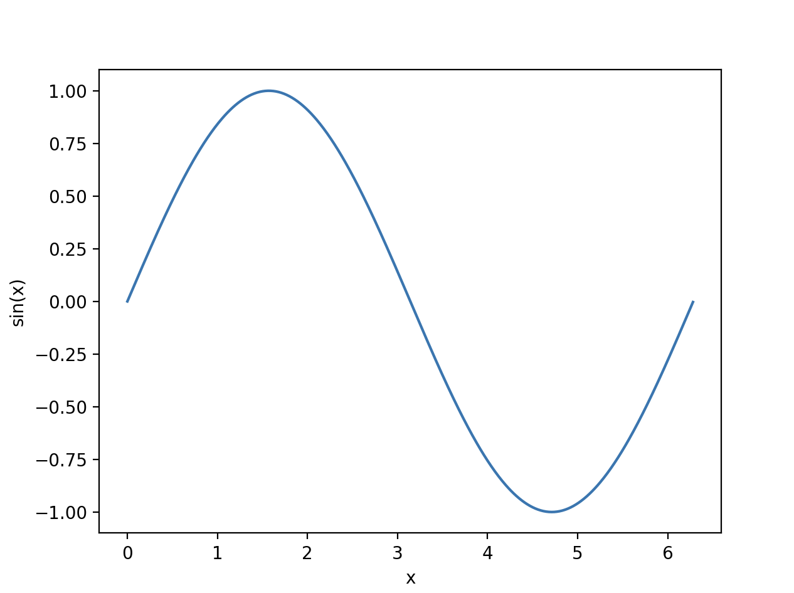
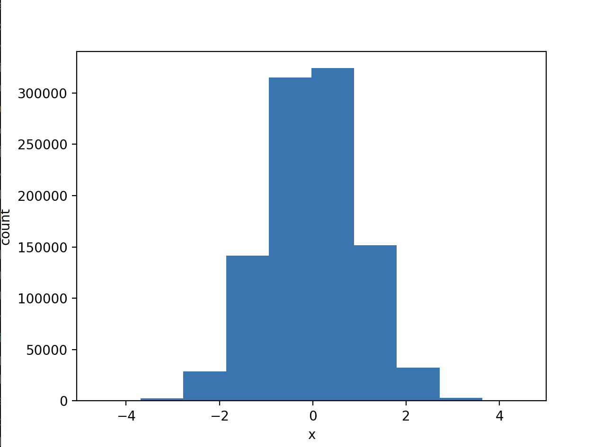

# Python

You shouldn't need to install python - both your base system, and your conda environment should have a version of python
installed already.  Check by typing

```
python --version
```

**Note.** On an M1 Mac, the `python` executable doesn't exist - you have to type `python3` instead.

On my system this says: `Python 3.9.6` if conda environment is **not** activated, and `Pythong 3.9.13` if it is. This illustrates an important point: **if you've installed conda you will have multiple python installations on your system**.  Also, note that python comes in two similar but slightly different flavours (python 2 and python 3).  For the most part you should use python 3.

## Running python

You can run python like this:

```
python
```

which takes you into the interactive python command prompt.  It looks something like this:


    Python 3.9.13 | packaged by conda-forge | (main, May 27 2022, 17:00:33) 
    [Clang 13.0.1 ] on darwin
    Type "help", "copyright", "credits" or "license" for more information.
    >>> 

Let's try it out, for example we could create a string variable:

```
a = "Hello, this is a string"
```

...split into words....
```
words = a.split( ' ' )
```

...and compute their lengths:
```
list( map( len, words )
```

This little example already illustrates a bunch of stuff in python:

* `split` is a string "method" (that is a function, but one which called in the form &lt;object&gt;.&lt;method()&gt;)  
* `split` produces a **list** - an ordered list of objects.
* We also used a so-called functional style: we applied `map()` to apply a function (`len()`) to each element of our list.

## ipython

The `python` interpreter is ok, and it's good for running python programs, but for interactive data analysis work you
will probably want to try out something more full-featured: `ipython`.  Quit python (e.g. by typing `quit()` or pressing
`ctrl-d`) and install it:
```
mamba install ipython
```

And run:
```
ipython
```

It looks pretty much like before, but you'll have a prompt that says `In [1]` instead of `>>>`.  It has helpful features like tab-completion of commands and filenames and syntax colouration.  

## python for data sciecne

To get a relaly good data science experience in python, we need a few packages.  The key ones are
`numpy` (which provides good support for matrices, arrays, and numeric manipulation), `pandas`
(which provides data frames), and `matplotlib` which is a plotting library.

To install these, use conda:
```
mamba install numpy pandas matplotlib
```

Once installed, start a python session and let's try it out with some examples [similar to those we
ran in R](R.md).  First import the needed bits of libraries:
```
from matplotlib import pyplot
import numpy
import math
```
These statement import the libraries and set them so they can be used locally as `pd`, `np`, `plt` etc.

Now, just like in R, we can make a simple plot:

```
x = numpy.arange( 0, 2 * math.pi, 0.01 )
pyplot.plot( x, numpy.sin(x) )
pyplot.xlabel( "x" )
pyplot.ylabel( "sin(x)" )
pyplot.show()
```



Or generate and histogram a million samples from a Gaussian distribution:

```
pyplot.hist(
    numpy.random.randn(1000000),
    bins = 100
)
pyplot.xlabel( "x" )
pyplot.ylabel( "count" )
pyplot.show()
```



## Next steps

To really make interactive python analyses fun, you're probably going to want to install JupyterLab. See [how to install Jupyterlab](Jupyterlab.md).

