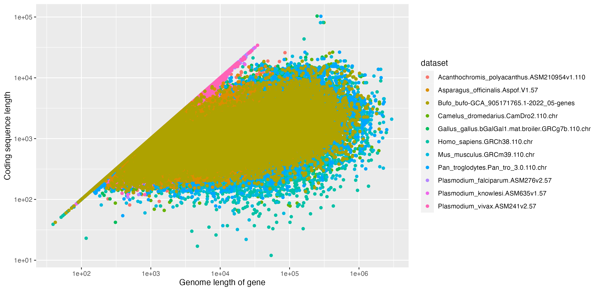

# Extreme genes revisited

Phew!  If you reached this point you have [computed the coding sequence length](./006_long_genes_2.md) of each transcript, and have produced a [table of genes linked to a 'canonical' transcript](./007_canonical_transcripts.md).  You may also have computed the [number of exons in each gene](./007_how_many_exons.md).

You're in good shape to find 'extreme' genes!

:::tip Challenge

Investigate 'extreme' genes now.

For example what are the biggest genes?  The genes with the most exons?  Are they similar across species?  Do they have related biological function?  What about the smallest genes?  What's an average gene size in each species?  What's an average number of exons?  What proportion of genes have just one exon?

Use your R skills, along with genome browsers and/or literature search to investigate - and have fun!

**Note**. You should follow whatever interests you most here - you won't be able to look at everything.

:::

As a starting point I suggest making histograms of these variables and plot them against each other.  For example, you could histogram the coding sequence length:
```r
(
	ggplot( data = genes )
	+ geom_histogram(
		aes(
			x = cds_length
		),
		bins = 100
	)
	+ xlab( "Coding sequence length of chosen transcript" )
	+ scale_x_log10()
	+ facet_wrap( ~ dataset )
)
```

:::caution Note

This histogram above has weird-looking artifacts around length 1,000 in some species.  What are those?

:::

Or you could plot it against the genome length of each gene:
```r
genes$length = genes$end - genes$start + 1
(
	ggplot( data = genes )
	+ geom_point( aes(
		x = length,
		y = cds_length,
		col = dataset
	))
	+ scale_x_log10()
	+ scale_y_log10()
	+ xlab( "Genome length of gene" )
	+ ylab( "Coding sequence length" )
)
```



:::tip Note

I used log scales above - what does the plot look like without that?  What id you facet over the datasets instead of
colouring them?  As always, experiment until you like the plot.

In this plot, all the points lie under the diagonal - why?

:::

You can then use filtering and sorting (`arrange()`) to identify the outlying genes in question, and investigate.

Good luck!  For example, here are some things I noticed:

* In all the data I looked at, there's only one gene with > 100 transcripts. It is the human gene [*MAPK10*,
  "Mitogen-activated protein kinase 10"](https://www.uniprot.org/uniprot/P53779) and it has >151 transcripts. (It has so
  many that it takes a while to load in
  [Ensembl](http://www.ensembl.org/Homo_sapiens/Gene/Summary?db=core;g=ENSG00000109339;r=4:85990007-86594625) or the
  [UCSC Genome
  browser](https://genome-euro.ucsc.edu/cgi-bin/hgTracks?db=hg38&lastVirtModeType=default&lastVirtModeExtraState=&virtModeType=default&virtMode=0&nonVirtPosition=&position=chr4%3A86016491%2D86594110&hgsid=275896231_HieWdPQTMOsgYQUFAnwTALgAECs0).)
  If you explore these genome browsers you will find a wealth of information on this gene including its expression
  patterns and function. Is there much published literature about it? What does it look like in other species?

* Only one gene has a coding sequence length over 100kb - the phenomenal [*Titin*](https://en.wikipedia.org/wiki/Titin).
  It is also by far the longest gene in chimpanzees, camels and mice.  It *also* stands out in terms of number of exons
- having a slightly incredible 184 exons in Chimpanzees (*Pan troglodytes*) and ~113 in humans.

* Another gene with lots of exons is [*Nebulin*](https://en.wikipedia.org/wiki/Nebulin). These genes seem especially huge in Chimpanzees. Are
they big in all species? In all great apes? Is there literature that might explain the results for these genes, or other
genes with lots of exons?
  
* The genes with lots of exons aren't the largest though (by genome length). In humans and chimpanzees, that accolade goes
  to [`RBFOX1`](http://www.ensembl.org/Homo_sapiens/Gene/Summary?db=core;g=ENSG00000078328;r=16:5239802-7713340)
  with a whopping length of around 2 and a half megabases, or 0.08% of the genome. What does this look
  like across species? Where is it expressed? (Interestingly, this gene has been previously associated [with aggressive
  behaviour](https://www.nature.com/articles/s41380-018-0068-7)).

* There are also some pretty tiny genes around. In humans one of the smallest seems to be
  [*ENSG00000288608*](http://www.ensembl.org/Homo_sapiens/Gene/Summary?db=core;g=ENSG00000288608;r=7:151061928-151061978;t=ENST00000674552),
  which is only 50 base pairs long. (However, it seems to be contained in an exon of the much
  longer [*SLC4A2* Anion exhange protein 2](https://genome-euro.ucsc.edu/cgi-bin/hgTracks?db=hg38&lastVirtModeType=default&lastVirtModeExtraState=&virtModeType=default&virtMode=0&nonVirtPosition=&position=chr7%3A151061877%2D151062029&hgsid=275886241_mxgWOGDr4elcf2SdW0zGz6ukwVJW).
  I'm not quite sure what this means...)

Essentially everything you look at is interesting here...
