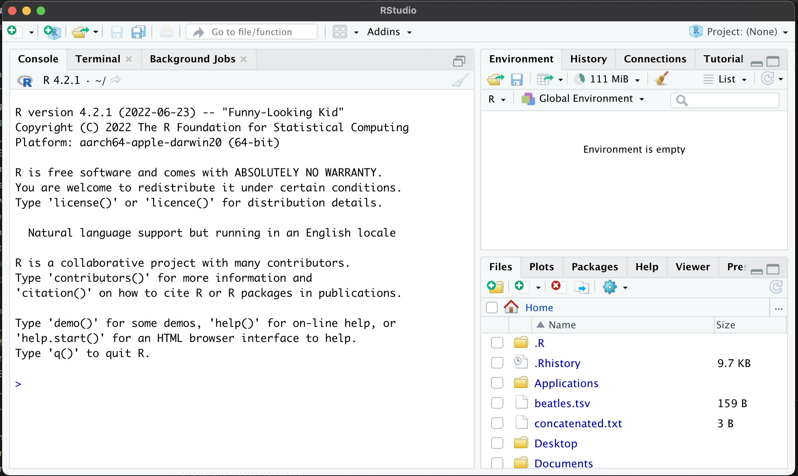

# Introduction to R

*Suggested prerequsite courses:* ***Introduction to the Command Line***, ***Programming Concepts***.

This short course is designed to teach the basics of the **R programming language**.

To use R, the very first thing you'll need to do (of course) is install R.  So let's do that now.

## Installing R

There are actually two things to install.  First, you want a version of R itself, and second, you'll
probably want to install *Rstudio Desktop*, which provides a nice way to use R.  Go and install
these now as follows:

* **R** can be downloaded from the 'Comprehensive R Archive Network'. First, pick [an appropriate
  mirror](https://cran.r-project.org/mirrors.html) and then click the appropriate download button.

* **Rstudio** can be downloaded from [rstudio.com](https://www.rstudio.com). Find the [Rstudio download
  page](https://posit.co/download/rstudio-desktop/).  Go there and click 'Download Rstudio'.  (Don't get the server
  version for now, which is different.)

Go and install both these packages now (with default options) and then try R out by running Rstudio.
You should see a window open with several panes, something like this:




:::tip Note

Another way to run R, if you prefer, is directly from the command-line.  To do this, in a terminal,
run the `R` command:

```
% R
```

This is not as easy to use as Rstudio, but is quite useful, for example, if you have to  work a
remote computer such as a compute cluster where there is no graphical interface.

:::

Whichever way you start R, you should end up seeing something like this:

```

R version 4.2.1 (2022-06-23) -- "Funny-Looking Kid"
Copyright (C) 2022 The R Foundation for Statistical Computing
Platform: aarch64-apple-darwin20 (64-bit)

[...]

Type 'q()' to quit R.

> 
```

To check your R is really working, let's try out a command.  For example we could print a message:
```
> print( "Hello there!" )
```

:::caution Note

The `>` is just there to indicate the prompt - don't type that!  Type the command and press `<enter>` to run it.

:::

You should see a result like:
```
[1] "Hello there!"
```

Congratulations, you've got R working!

:::tip  An aside on JupyterLab

Yet another way to use R is to install the [R kernel for
JupyterLab](../../prerequisites/Jupyterlab.md#using-r-python-and-julia-with-jupyterlab). This provides a 'notebook' way
   to use R, letting you interleave analyses with text and images to create analysis reports.

This is a great way to work, but a bit different from plain R programming.  For this tutorial we'll assume you are using
a plain R prompt as described above.

:::


Now you've got it working, you're ready to try out some [fundamentals](./fundamentals.md).

