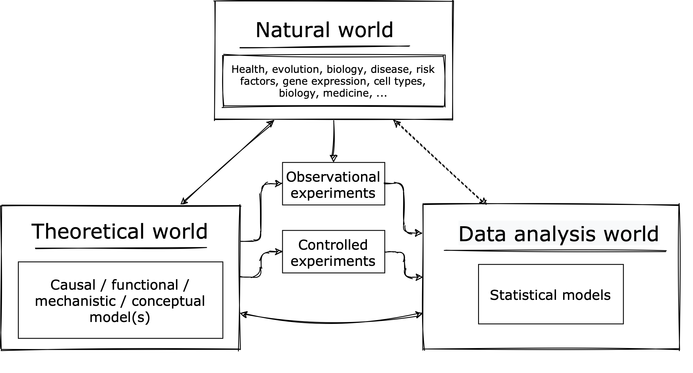

# Where statistics fits in

In my mind, science looks something like this:

On the top we have the real world - things we are interested in.

On the left is the world of scientific models.  These are simplified, conceptual, functional models of how the real
world works.  This is where much of science takes place: we make hypotheses and try to find support or refute them.

To do this, we generate and analyse data - this is the **data analysis world** on the right.  In this section we'll
focus on that part of science, that is, on how to analyse and interpret data once it has been generated.  

:::caution Warning

Even though we're focussing on the right hand part - where statistics works - it's important to realise that we can't
just ignore the left hand part.  In fact, interpreting statistical results is typically impossible without placing them
in a scientific context - that is, within a theory or conceptual ideas about the underlying science.

:::

