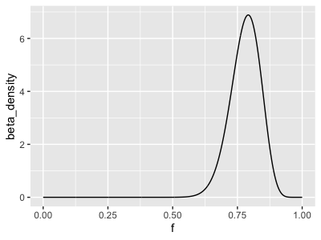

# Parameter estimation

### The bayesian appoach

We will call $P( \text{parameters}|\text{data})$ the **posterior**. It is the probability of the given parameters, *after* seeing the
data - hence the name.

Bayes' rule tells us how to express the posterior in terms of the likelihood.  Specifically:

$$
P( \text{parameters}|\text{data}) = \frac{P(\text{data}|\text{parameters}) \times P(\text{parameters})}{\text{a normalising constant}}
$$

The terms in this formula have specific names:

* $P(\text{data}|\text{parameters})$ is the *likelihood function*.  This is what we described above.

* $P(\text{parameters})$ is a *prior* or *prior distribution*. It is supposed to say what our belief in the parameters is before we
  have seen the data.
  
* The term on the left, $P(\text{parameters}|\text{data})$ is the *posterior distribution*. It says what our belief in the
  parameters should be *after* seeing the data.
  
So we could re-write that as:

$$
\text{posterior} = \frac{\text{likelihood} \times \text{prior}}{\text{normalising constant}}
$$  

The 'normalising constant' is just there to make sure that the posterior is really a probability density - that is, that is sums to
one over all possible parameter values. (It is 'constant' because it doesn't depend on the parameters).

### Frequency estimation example

For example, in the frequency example above, let's suppose we use a 'uniform' prior on the frequency (any frequency equally
likely). Then the posterior distribution will have exactly the same form as the likelihood (i.e. a binomial distribution)
**except** that it has a different normalising constant - it is:

$$
P(f|N_A,N_G) = \text{constant} \times f^{N_G}\cdot(1-f)^{N_A}
$$

where the constant is now computed so that the expression integrates to 1 over the whole of parameter space (as opposed to over all
of data space, as it was earlier). 

For this example, it turns out that this constant can be readily computed and it is given by a special function known as the [beta
function](https://en.wikipedia.org/wiki/Beta_function). Specifically the constant is:

$$
\text{constant} = \frac{1}{B(N_A+1,N_G+1)}
$$

The resulting distribution is called the [beta distribution](https://en.wikipedia.org/wiki/Beta_distribution) and it is
(unsurprisingly) already implemented in R - making it easy to work with.

To check I'm not making this up, try plotting the beta distribution density now:

```
plot_data$beta_density = dbeta(
    plot_data$f,
    shape1 = 38+1, # need to add one to counts, due to how beta is defined
    shape2 = 10+1  # ditto
)
p = (
    ggplot(
        data = plot_data,
        mapping = aes( x = f, y = beta_density )
    )
    + geom_line()
)
print(p)
```


If you compare this to the above you should see that this is *identical to the likelihood function* except for a change in y axis
scale.

This beta distribution is therefore our posterior - it represents our full 'parameter inference' for the model. This is very
useful! For example, suppose we wanted to find an interval that has 95% chance of containing the true frequency:

```
quantiles = qbeta(
    c( 0.025, 0.975 ),
    shape1 = 38+1,
    shape2 = 10+1,
    lower.tail = T
)

print(
    p + geom_vline( xintercept = quantiles, linetype = 2, col = 'red' )
)
```


In other words, after seeing these data, and **as long as we believe our likelihood and prior**, we should have 95% belief that the
frequency is between $0.66$ and $0.88$.
